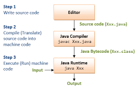
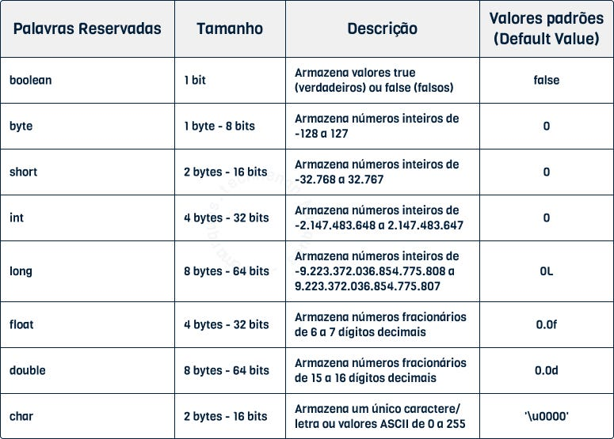

## Maratona Java

Java é uma linguagem multiplataforma e baseada em bytecode, podendo ser executada em qualquer máquina que possua a JVM.
Basta compilar e executar o programa em qualquer máquina que tenha a JVM instalada.
É uma linguagem orientada a objetos, ou seja, é dividida em classes.

## Tipos Primitivos em Java

Utilizamos os tipos para definir variaveis. 

por exemplo: int numero = 1;
